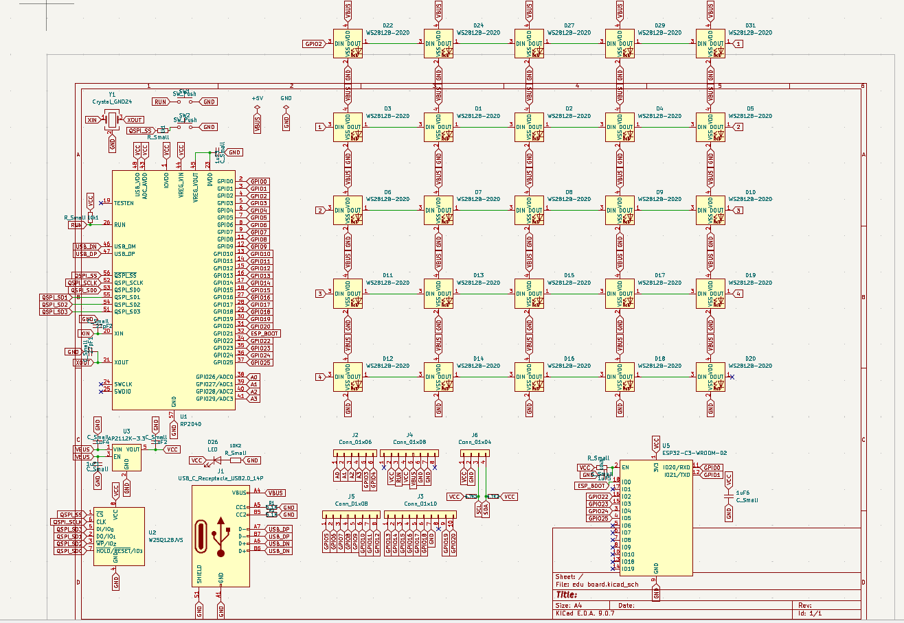
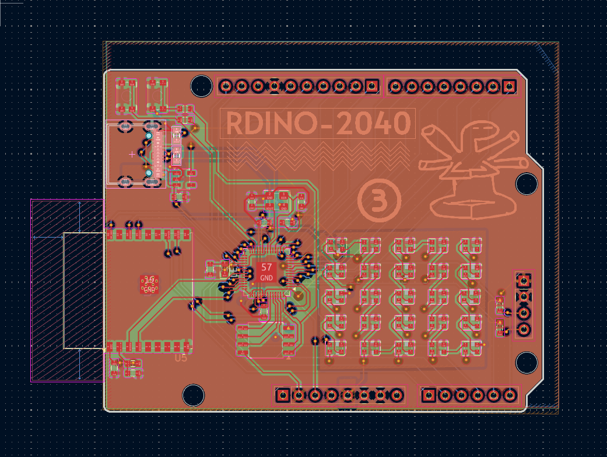

# rdino
rp-2040 development board in the shape of arduino uno r3 so it supports its hats and also has esp32 for wifi and bluetooth and 5x5 grid of neo pixel leds

it has dual microcontroller so all the less important repetative tasks can be off loaded to esp32 and main work can be done by the rp 2040 chip with extra 16M bit memory
and it can be used foor any project like lfr robot , micromouse , rc car etc

| Component | Purpose | Qty | Cost (USD) | Distributor |
| --- | --- | --- | --- | --- |
| RP2040 (QFN-56) | Main Microcontroller | 1 | ₹81.00 | [Evelta](https://evelta.com/rp2040-264kb-sram-dual-arm-cortex-m0-processor-mcu-by-raspberry-pi/?srsltid=AfmBOopaIG6fpnSNGs3z4S0e6P0bgP9_VYOyHm1yW1iu5uU8jt_uu5J_) |
| ESP32-C3-WROOM-02 | Wi-Fi / BLE Module | 1 | ₹312 | [Evelta](https://evelta.com/esp32-c3-wroom-02-n4-wi-fi-ble-module-4mb-flash-pcb-antenna/?sku=136-ESP32-C3-WROOM-02-N4&utm_source=google&utm_campaign=19958243666&utm_medium=cpc&utm_content=&utm_term=&gad_source=1&gad_campaignid=19958265965&gclid=Cj0KCQjwsMLSBhD9ARIsAIpUTDqEPgMN1OtKYFDDmMqUSGKSXAjHzA4DRwzgzZp3zSiW1o8-RgKeGbgaAoSMEALw_wcB) |
| W25Q128JVS (SOIC-8) | 128Mbit Flash Memory | 1 | ₹223 | [Evelta](https://evelta.com/serial-nor-flash-memory-128mbit-8pin-soic/?sku=153-W25Q128JVSIQ&utm_source=google&utm_campaign=19958243666&utm_medium=cpc&utm_content=&utm_term=&gad_source=1&gad_campaignid=19958265965&gclid=Cj0KCQjwsMLSBhD9ARIsAIpUTDqgAe2PFV_ZbwzCVTig-jSF6n-lNv5TzVO5kI0fkOoLNDz-UcC87KoaAvCyEALw_wcB) |
| AP2112K-3.3 (SOT-23-5) | 3.3V LDO Voltage Regulator | 1 | ₹24 | [Evelta](https://evelta.com/linear-voltage-regulator-positive-fixed-1-output-300ma-ic-sot-23-5/?sku=035-TLV74033PDBVR&utm_source=google&utm_campaign=19958243666&utm_medium=cpc&utm_content=&utm_term=&gad_source=1&gad_campaignid=19958265965&gclid=Cj0KCQjwsMLSBhD9ARIsAIpUTDpVNRkkdR8DkeeqQDI-B0SV4mmE5r7KHuDlczT8pWqQnIAxcDNvTTQaAnOdEALw_wcB#productDescription) |
| WS2812B-2020 (PLCC4) | Addressable RGB LEDs (D1-D24, D27, D29, D31) | 25 | ₹275 | [Robu](https://robu.in/product/1-month-warranty-953/?gad_source=1&gad_campaignid=17427802703&gclid=Cj0KCQjwsMLSBhD9ARIsAIpUTDpt1pzF430Rd8rggMbqOhyDVxqaDctheh1CFh1cCbUzKa_cTqI4nuYaAhGvEALw_wcB) |
| 74AHCT125 | 3.3v to 5v converter | 1 | ₹37 | [Digikey](https://www.digikey.in/en/products/detail/nexperia-usa-inc/74AHCT125PW-118/1229606) |
| Standard LED (0603) | Status Indicator (D26) | 1 | ₹3.3 | [evelta](https://evelta.com/0603-orange-chip-led/?srsltid=AfmBOopJK48IT0WFYCzFETDcCPIIkiPRop17X2j5vajIVfQTBZ31vxPa) |
| USB-C Receptacle 14-Pin | Power and Data Interface (J1) | 1 | ₹8 | [Hubtronics](https://hubtronics.in/usb-type-c-16p-female-connector-surface-mount?srsltid=AfmBOordf7MpBH0Qx-t9NQyY5B-fdjtzOuCBNZ2MHx8Cz8tkCzKM3Jp4zG4) |
| 1x04 Pin Header/Socket | I/O Expansion / Programming (J6) | 1 | ₹11 | [Robu](https://robu.in/product/fh2-0-09-04pzd-xunpu-plugin1x4-pin-2mm-female-headers-rohs/?gad_source=1&gad_campaignid=17427802703&gclid=CjwKCAjw08fSBhA7EiwAfbQTsMGuGFKjKxeAs85tsGpJZ_VgBg9C0syUiuKSdEVnRGq6vaZT8pyhIhoCEKcQAvD_BwE)|
| 1x06 Pin Header/Socket | I/O Expansion (J2) | 5 | ₹53 | [Robu](https://robu.in/product/6-pin-female-11mm-tall-stackable-header-connector-for-arduino-5pcs/) |
| 1x08 Pin Header/Socket | I/O Expansion (J4, J5) | 2 | ₹32 | [Robu](https://robu.in/product/fh1-27-01-08pzd-xunpu-plugin1x8-pin-1-27mm-female-headers-rohs/?gad_source=1&gad_campaignid=17427802703&gclid=CjwKCAjw08fSBhA7EiwAfbQTsAXYrqE1Rld57TzQKy9yslqVRvfkEbmGVCeCCZim9T4gCUaC_6xX4xoCpCAQAvD_BwE) |
| 1x10 Pin Header/Socket | I/O Expansion (J3) | 1 | ₹17 | [Robu](https://robu.in/product/fh1-27-01-10pzd-xunpu-plugin1x10-pin-1-27mm-female-headers-rohs/) |
| Push Button (KMR2) | Reset / User Input (SW1, SW2) | 2 | ₹126 | [Robu](https://robu.in/product/kmr221nglfs-ck-2-8mm-0-5mm-round-button-50ma-vertical-welding-4-2mm-spst-2n-32v-smd-tactile-switches-rohs/) |
| 1.1kΩ Resistor (0603) | Current Limiting / Pull-up | 1 | ₹1 | [Robu](https://robu.in/product/0603waj0112t5e-uniohm-royal-ohm-100mw-thick-film-resistors-75v-%C2%B1100ppm-%E2%84%83%C2%B15-1-1k%CF%89-0603-chip-resistor-surface-mount-rohs/) |
| 4.7kΩ Resistor (0603) | I2C / General Pull-up | 2 | ₹5 | [Robu](https://robu.in/product/rt0603brd074k7l-yageo-res-thin-film-0603-4-7k-ohm-0-1-0-1w1-10w-%C2%B125ppm-c-pad-smd-t-r/) |
| 10kΩ Resistor (0603) | Pull-up / Pull-down | 3 | ₹3 | [Robu](https://robu.in/product/10k-ohm-1-4w-0603-surface-mount-chip-resistor-pack-of-100/) |
| 5.1kΩ Resistor (0603) | USB-C CC line Pull-down | 2 | ₹3 | [Robu](https://robu.in/product/rt0603fre075k1l-yageo-100mw-thin-film-resistor-75v-%C2%B150ppm-%E2%84%83-%C2%B11-5-1k%CF%89-0603-chip-resistor-surface-mount-rohs/) |
| 1μF Capacitor (0603) | Decoupling / Bypass | 6 | ₹8.5 | [Robu](https://robu.in/product/1uf-1000nf-50v-capacitor-0603-smd-package-pack-of-20/) |
| 10pF Capacitor (0603) | Crystal Load Capacitors | 2 | ₹1 | [Robu](https://robu.in/product/10pf-0603-surface-mount-multilayer-ceramic-capacitor-pack-of-50/) |
| Crystal 3225 (4-Pin) | Clock Source for RP2040 (Y1) | 1 | ₹101 | [lion circuit](https://www.lioncircuits.com/parts/NX3225SA-12MHZ-STD-CSR-6) |
| PCB | PCB | 1 | ₹3375 | [Robu] |
| Hot plate | soldering | 1 | ₹2,749 | [Amazon](https://www.amazon.in/Preheating-Soldering-Preheater-Platform-56x56x35mm/dp/B0C7W3W8C4?source=ps-sl-shoppingads-lpcontext&psc=1&smid=A2PRL1RFFZO5CK) |

The Bare Components : ₹1,324.80

PCB Fabrication (Robu): ₹3,375.00

Assembly Tools (Amazon): ₹2,749.00

Grand Total: ₹7,448.80
